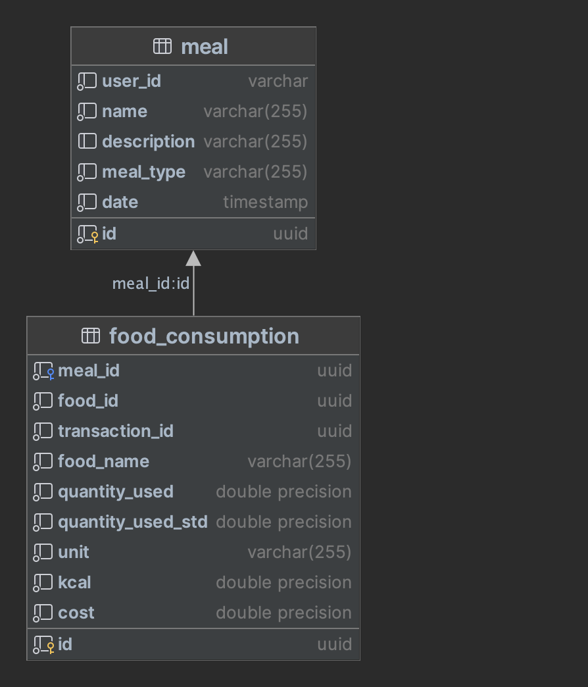
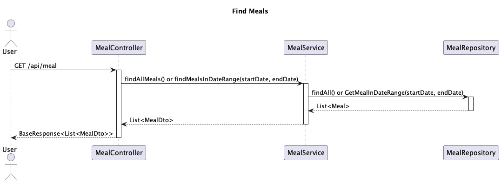
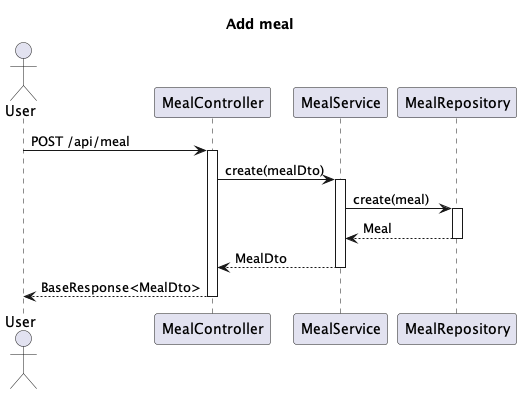
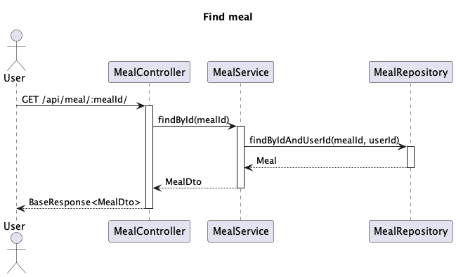
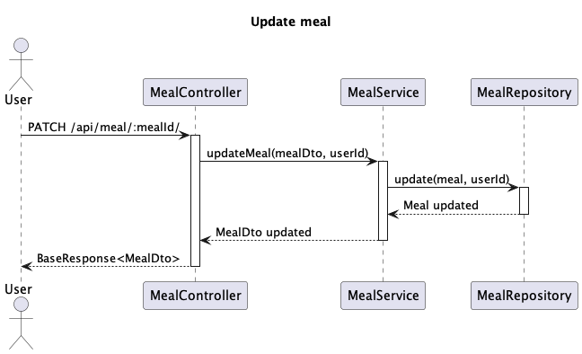
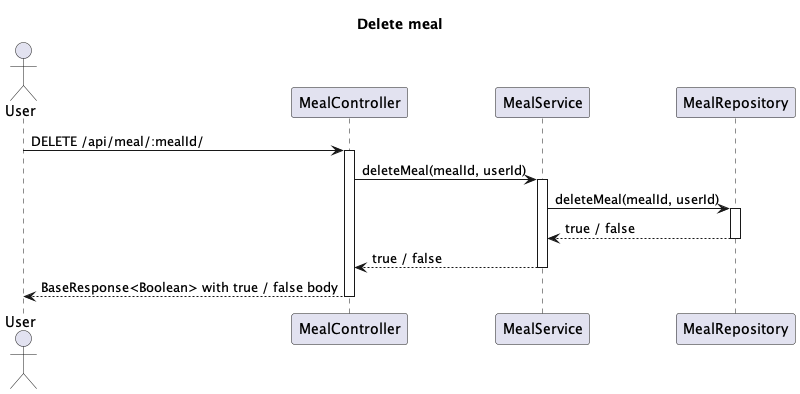

# Food-track-be

## Description

This application is a piece of foody project, in detail it keeps track about user’s food usage and assumed calories.

Combined with [grocery-be](https://github.com/nico-iaco/grocery-be) module this application provide extended features
like food availability and food data.

## Features

- [x] Add meals
- [x] Add food consumed
- [x] Calculate meal calories and price

## Technologies

- [Golang](https://golang.org/)
- [Gin](https://gin-gonic.com/)
- [Bun](https://bun.uptrace.dev/)
- [Firebase](https://firebase.google.com/)
- [Smapping](https://github.com/mashingan/smapping)
- [Gobreaker](https://github.com/sony/gobreaker)

## Requirements

- [PostgreSQL](https://www.postgresql.org/)
- [grocery-be](https://github.com/nico-iaco/grocery-be)

## Installation

### Cluster installation

To install this app in a cluster, first create grocery namespace, then modify the kustomization.yaml file in
/k8s/overlays/qa
changing the property to match your configuration and run the following command:

```bash
kubectl apply -k k8s/overlays/qa
```

### Local installation

You can run this app locally with docker. To do so, run the following command:

```bash
docker run -p 8080:8080 ghcr.io/nico-iaco/food-track-be:latest -e {ALL_ENV_VARIABLES}
```

## Environment variables

| Name             | Description                       | Default value |
|------------------|-----------------------------------|---------------|
| PORT             | Port on which the app will listen | 8080          |
| GIN_MODE         | Release type of app               |               |
| DB_HOST          | Database host                     |               |
| DB_PORT          | Database port                     |               |
| DB_NAME          | Database name                     |               |
| DB_USER          | Database user                     |               |
| DB_PASSWORD      | Database password                 |               |
| GROCERY_BASE_URL | Base url for grocery-be app       |               |
| DB_TIMEOUT       | Database connection timeout       |               |

## Database

To create the database, run the following command with the database user:



```sql
CREATE DATABASE food_track;
```

```sql
create table meal
(
    id          uuid primary key,
    user_id     varchar(255) not null,
    name        varchar(255) not null,
    description varchar(255),
    meal_type   varchar(255) not null,
    date        date         not null
);
```

```sql
create table food_consumption
(
    id                uuid primary key,
    meal_id           uuid         not null,
    food_id           uuid         not null,
    transaction_id    uuid         not null,
    food_name         varchar(255) not null,
    quantity_used     float        not null,
    quantity_used_std float        not null,
    unit              varchar(255) not null,
    kcal              float        not null,
    cost              float        not null,
    foreign key (meal_id) references meal (id)
);
```

## Apis and diagrams

### Find all meals

**Path**: `/api/meal`

**Method**: `GET`

**Query parameter**

| name       | type              | required |
|------------|-------------------|----------|
| startRange | date - dd-MM-yyyy | no       |
| endRange   | date - dd-MM-yyyy | no       |

**Response**

```json
{
  "body": [
    {
      "id": "76534441-5150-4ba3-98f9-a8e463c7c59b",
      "userId": "76534441-5150-4ba3-98f9-a8e463c7c59b",
      "name": "test",
      "description": "test",
      "mealType": "breakfast",
      "date": "2023-01-28T10:50:19Z",
      "kcal": 235.5,
      "cost": 0.124375
    }
  ],
  "errorMessage": ""
}
```



## Add meal

**Path**: `/api/meal`

**Method**: `POST`

**Request Body**

```json
{
  "id": "76534441-5150-4ba3-98f9-a8e463c7c59b",
  "userId": "76534441-5150-4ba3-98f9-a8e463c7c59b",
  "name": "test",
  "description": "test",
  "mealType": "breakfast",
  "date": "2023-01-28T10:50:19Z",
  "kcal": 235.5,
  "cost": 0.124375
}
```

**Response**

```json
{
  "body": {
    "id": "76534441-5150-4ba3-98f9-a8e463c7c59b",
    "userId": "76534441-5150-4ba3-98f9-a8e463c7c59b",
    "name": "test",
    "description": "test",
    "mealType": "breakfast",
    "date": "2023-01-28T10:50:19Z",
    "kcal": 235.5,
    "cost": 0.124375
  },
  "errorMessage": ""
}
```



## Find meal

**Path**: `/api/meal/:mealId/`

**Method**: `GET`

**Response**

```json
{
  "body": {
    "id": "76534441-5150-4ba3-98f9-a8e463c7c59b",
    "userId": "76534441-5150-4ba3-98f9-a8e463c7c59b",
    "name": "test",
    "description": "test",
    "mealType": "breakfast",
    "date": "2023-01-28T10:50:19Z",
    "kcal": 235.5,
    "cost": 0.124375
  },
  "errorMessage": ""
}
```



## Update meal

**Path**: `/api/meal/:mealId/`

**Method**: `PATCH`

**Request body**
```json
{
  "name": "updatedTest",
  "description": "updatedTest"
}
```

**Response**
```json
{
	"body": {
		"id": "76534441-5150-4ba3-98f9-a8e463c7c59b",
		"userId": "76534441-5150-4ba3-98f9-a8e463c7c59b",
		"name": "updatedTest",
		"description": "updatedTest",
		"mealType": "breakfast",
		"date": "2023-01-28T10:50:19Z",
		"kcal": 235.5,
		"cost": 0.124375
	},
	"errorMessage": ""
}
```



## Delete meal

**Path**: `/api/meal/:mealId/`

**Method**: `DELETE`

**Response**
```json
{
  "body": true,
  "errorMessage": ""
}
```

